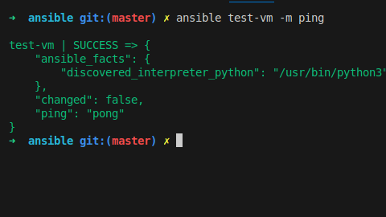
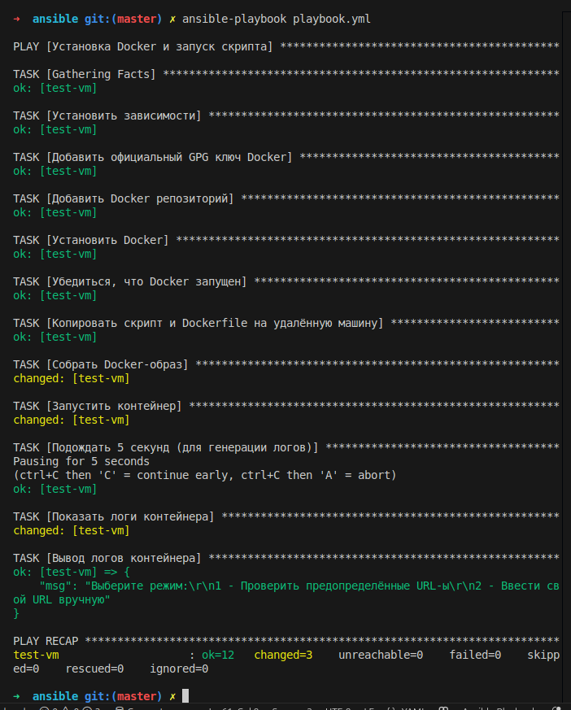
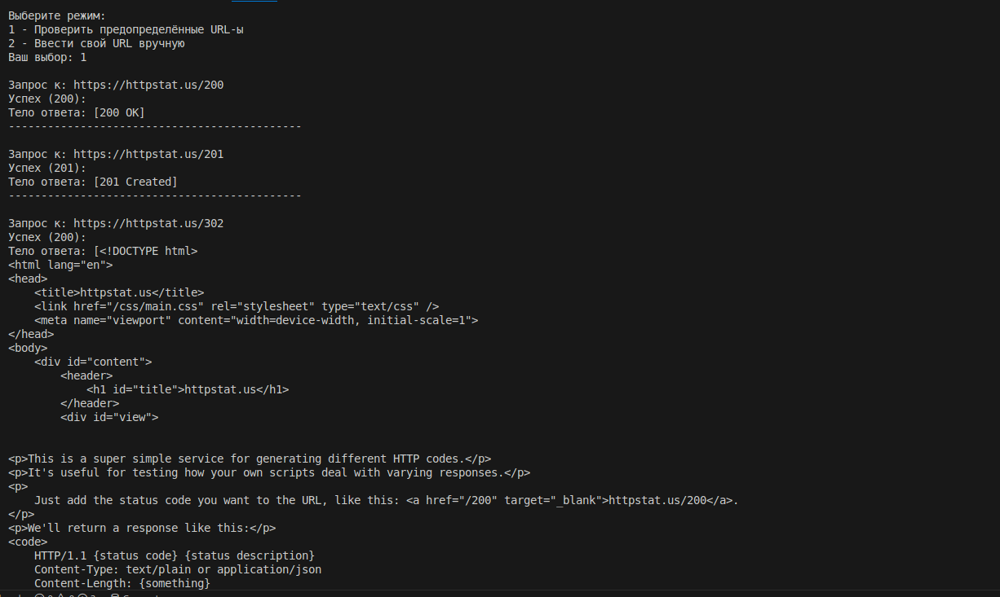

# Тестовое задание по Devops, выполнил Юрков Максим
## Зависимости
VBox - https://www.virtualbox.org/wiki/Downloads  
Vagrant - https://developer.hashicorp.com/vagrant/install  
Ansible - https://docs.ansible.com/ansible/latest/installation_guide/intro_installation.html  

## Развертывание тестовой ВМ с помощью Vagrant
Для автоматического создания ВМ в проекте используется Vagrant. Чтобы создать ВМ, заходим в директорию с Vagrantfile:
```bash
cd vagrant
```

и применяем команду:

```bash
vagrant up
```

Затем экспортируем ssh_config:

```bash
vagrant ssh-config > ssh_config
```

## Настройка Ansible
Используем этот конфиг и приватный ключ, который сгенерировал Vagrant, в Ansible.
```ini
[vm]
metrics_vm ansible_ssh_common_args='-F ../vagrant/ssh_config'
```

Проверяем соединение Ansible и ВМ:

```bash
ansible vm -m ping
```


## Запуск Ansible-playbook
У нас есть приложение http_check.py и Dockerfile. Нужно установить зависимости, запустить приложение в контейнере и проверить его работоспособность. Сам скрипт написан на Python c использованием библиотеки requests. Для контейнеризации будем использовать Docker. Для автоматического развертывания данного сервиса применяем Ansible.

### Proof of Concept
  


